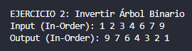
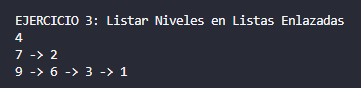
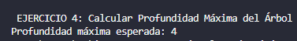

# Estructuras No Lineales – Ejercicios Árboles

**Nombre: Diana Borja**

**Fecha: 10/01/2026**

Este proyecto contiene la solución a cuatro ejercicios prácticos sobre estructuras de datos tipo árbol binario, como parte del aprendizaje de estructuras no lineales en Java. Cada ejercicio se encuentra organizado en su propia carpeta, siguiendo la convención de paquetes y buenas prácticas.

---

## Explicación para el estudiante

```
src/
│
├── Materia/
│
├── Ejercicio_01_insert/
├── Ejercicio_02_invert/
├── Ejercicio_03_listLeves/
└── Ejercicio_04_depth/
```

---

## Descripción de Ejercicios

### Ejercicio 01: Insertar en un Árbol Binario de Búsqueda (BST)

Carpeta: `Ejercicio_01_insert`

Objetivo: Construir un Árbol Binario de Búsqueda manteniendo su propiedad fundamental: hijos izquierdos menores que la raíz y hijos derechos mayores.

Funcionamiento: Se utiliza un método recursivo que compara el valor a insertar con el valor del nodo actual. Si es menor, se desplaza a la izquierda; si es mayor, a la derecha. Cuando encuentra un espacio vacío (null), crea el nuevo nodo.

Input: [5, 3, 7, 2, 4, 6, 8]
## Resultados Obtenidos:


---

### Ejercicio 02: Invertir un Árbol Binario

📂 Carpeta: `Ejercicio_02_invert`

Objetivo: Transformar un árbol binario en su imagen especular.

Funcionamiento: Se implementa un recorrido Post-orden (Izquierda, Derecha, Raíz). El algoritmo intercambia recursivamente el hijo izquierdo por el derecho en cada nodo del árbol hasta llegar a las hojas.

Complejidad: O(n), donde n es el número de nodos.

## Resultados Obtenidos:


---

### Ejercicio 03: Listar Niveles en Listas Enlazadas

📂 Carpeta: `Ejercicio_03_listLeves`

Objetivo: Agrupar los nodos de cada profundidad en una estructura de lista independiente.

Funcionamiento: Se utiliza un recorrido de tipo BFS (Breadth-First Search) o un DFS modificado que pasa el nivel actual como parámetro. Los nodos se agregan a una LinkedList que corresponde a su índice de nivel. El resultado es una lista de listas (ej. List<LinkedList<Node>>).

Output esperado: Una lista por cada nivel del árbol.
## Resultados Obtenidos:


---

### Ejercicio 04: Calcular la Profundidad Máxima

Carpeta: `Ejercicio_04_depth`

Objetivo: Determinar el camino más largo desde la raíz hasta la hoja más lejana.

Funcionamiento: Se calcula de forma recursiva la altura de los subárboles izquierdo y derecho. La profundidad en cada nodo se define mediante la fórmula:$$\text{profundidad} = 1 + \max(\text{altura\_izq}, \text{altura\_der})$$El caso base es cuando un nodo es null, retornando 0.

## Resultados Obtenidos:


---


## Rúbrica de Calificación

| **Criterio**       | **Descripción**                                                                       | **Puntaje** |
| ------------------ | ------------------------------------------------------------------------------------- | ----------- |
| **Informe**        | No hay informe                                                                        | 0 pts       |
|                    | Informe parcial **sin explicación** de cada método                                    | 1 pt        |
|                    | Informe parcial **con explicación** de cada método                                    | 2 pts       |
|                    | Informe completo                                                                      | 3 pts       |
| **Funcionamiento** | No implementado                                                                       | 0 pts       |
|                    | Implementado parcialmente: <br>• Ejercicio 1 y 4 → 2 pts<br>• Ejercicio 2 y 3 → 4 pts | 2–4 pts     |
|                    | Código funcional pero **no pasa todas las pruebas**                                   | 6 pts       |
|                    | Código funcional y **pasa todas las pruebas correctamente**                           | 7 pts       |


## Contribuir

Para contribuir a este proyecto, por favor crea un fork y envía una solicitud de extracción, o simplemente abre un issue con tus comentarios y sugerencias.

## Autores

- [PABLO TORRES] - Desarrollo inicial
- [DIANA BORJA] – Desarrollo de ejercicios

## Resultados - Ejercicio 1   


